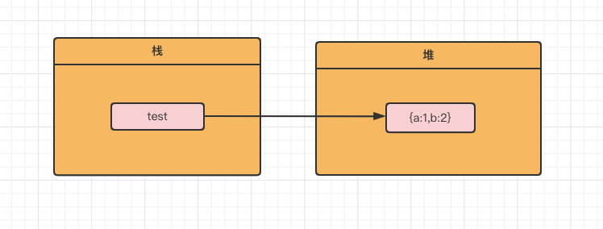
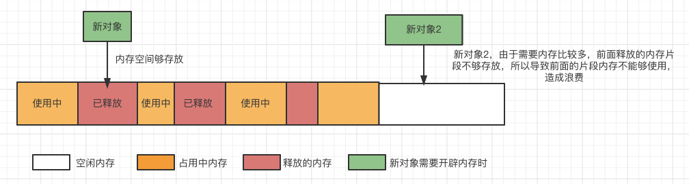

# 带你了解 Chrome V8 引擎的垃圾回收机制

## 前言

所有程序的运行，都需要内存。对于前端来说，JS 自身是没有内存管理能力和垃圾回收能力的，这一部分的工作会交给我们的浏览器引擎，我们最熟悉的应该就是 Chrome 浏览器的 V8 引擎 **（下文都以 V8 来展开讨论）** 。
在 C++当中，开发人员可以直接调用原生 API 来进行内存的开辟和回收。但是像 Javascript ，变量内存的开辟和回收都由浏览器引擎来进行处理，作为前端开发，不需要关心分配内存和垃圾回收这一事项，简单来说就是 Javascript 具备了自动垃圾回收的机制。

---

## 为什么需要垃圾回收？

前面讲了 V8 引擎会帮我们进行自动地垃圾回收，那我们为什么要进行垃圾回收呢？不要进行回收可以吗？答案肯定是不可以的。看看如下代码：

```javascript
var test = { a: 1, b: 2 };
test = [1, 2, 3, 4, 5];
```

按照正常的代码逻辑，可以理解为，我们声明了一个变量 **test** ，他引用了 **{a:1,b:2}** 这个对象，然后我们就为 test 重新赋值。test 的地址就指向了 **[1,2,3,4,5]** 这个组数了。然后可以发现内存中，已没有了对 **{a:1,b:2}** 这个对象的引用
那么想象下如果 N 个这种对象保留在内存中，那么就会导致内存溢出了。但是浏览器引擎在这里帮我们做了自动的垃圾回收。下图解释了上面刚刚那个流程



总结：要保证程序内存在程序运行中一直够用，那么就需要引入垃圾回收机制。

---

## 垃圾回收策略

那么既然是自动地进行垃圾回收，那么我们又如何知道无用的内存(垃圾)何时被回收呢？如何回收。那么这个回收的流程，必须要引入一些比较高效的算法策略了
垃圾回收有以下最常见的两种策略：

- 标记清除法（Mark-Sweep）
- 引用计数法（Reference Counting）

> 稍微讲下引用计数法的缺点：引用计数的算法，若两个变量均存在指向自身的引用，因此两个相互引用的对象无法被回收，导致内存泄漏。

这里因为 V8 及大部分浏览器引擎使用的是标记清除法，那么我们在本文只会围绕标记清楚法来进行讨论。

### 标记清除法

**标记清除法（Mark-Sweep）**，主要分为了两个阶段。 **标记阶段** 和 **清除阶段**
标记阶段：从根对象出发，遍历内存中所有对象，并给对象都打上标记。
清除阶段：清除阶段则把没有标记（对象没有被使用（引用））进行销毁。

整个标记清除算法的一轮处理过程如下：

1. 给内存中的变量都打上标记 0
2. 然后从各个根对象开始遍历，把不是垃圾（还在使用的）的节点改成 1
3. 清理所有标记为 0 的垃圾，销毁该对象，回收它们所占用的内存空间
4. 最后，重新把所有内存中对象标记修改为 0，等待下一轮垃圾回收。

上述就是标准的标记清除法。但是上面所说的标记清除法有一缺点，就是垃圾回收后的内存，因为内存空间没有被重新整理，那么就导致了内存空间不连续了。


从上图可以看出被释放的内存由于未被整理，导致内存空间不连续，浪费了一定的内存空间
再来看看这种不连续的片段会为之后内存的使用有什么影响



### V8 的 GC 优化

V8 用的是标记清楚法。
那看看具体是如何进行的垃圾回收。
看看 V8 引擎是如何分配内存的（图片来源于网络）；


可以看得出 V8 的内存分布如下，每个区域都有对应的职能

1. 新生代（new_space）：大部分对象一开始都会被分配到新生代区中，这个区域中的 GC 十分频繁；
2. 老生代(old_space)：属于老生代，这里只保存原始数据对象，这些对象没有指向其他对象的指针；
3. 大对象区(large_object_space)：这里存放体积超越其他区大小的对象，每个对象有自己的内存，垃圾回收其不会移动大对象区；
4. 代码区(code_space) ：代码对象，会被分配在这里。存放可执行代码；
5. map 区(map_space)：存放 Cell 和 Map，每个区域都是存放相同大小的元素，结构简单。(简单说：存储对象的映射关系的区域)；

V8 的垃圾回收主要围绕 新生代区和老生代区进行，下面将围绕这两个区域进行讨论。
先引出两个区域各用了什么算法

> 新生代：Scavenge

> 老生代：Mark-Sweep & Mark-Compact

Mark-Sweep(标记清除): 分为了两个阶段， 标记 和 清楚 两个阶段。
Mark-Compact(标记整理):对不连续的碎片进行整理。移动对象在堆中的位置。

### 新生代区。scavenge 算法

step1

那整体流程时这样的。

1. 新生代区会等分化成 2 个区块。
2. 假设命名两个区块为 from_space 和 to_space
3. 刚创建的对象都会放到 from_space 块
4. 当主线程代码执行完后，会马上执行一次 GC
5. 会全量的把还有在引用的对象放到我们的 to 当中
6. 剩下在 Form 的对象未被引用，则清除，被回收。
7. 然后次数 to 的角色与 Form 的角色 将会在下一次垃圾回收时互换。

### 新生代晋升

step2

1. 新生代的对象会在一定时间后会晋升到我们的老生代区中。
2. 新生代晋升必须要
3. 满足以下任何一个条件之一
   > 1. 最少经历一次 scavenge
   > 2. scavenge 后 To 区域内存大于 25%时。

### 进行老生代区后

主要是用了 三色标记法，和前面提到的标记清除法 1/0 标记不一样。

白：未被标记的对象，即不可达对象（没有扫描到的对象），可回收
灰：已被标记的对象（可达对象），但是对象还没有被扫描完，不可回收
黑：已被扫描完（可达对象），不可回收
step3

1. 进行老生代区后，使用的是标记清除法进行 GC

   - 垃圾回收器会以 window 为根节点，从全局触发去寻找可被访问到的变量，如被访问到则视为活动的，
   - 未被访问到的则会视为垃圾，进行垃圾回收，内存释放。

2. 标记清楚会导致内存空间存在不连续的状态，因为我们清除的对象占用的内存地址可能是不连续的。
3. 所以为了解决不连续的问题，就有了标记整理，将活动的对象往堆的一段进行移动，完成后再释放掉左/右边界的内存。所以标记清除法的整体流程就是标记 - 整理 - 清除

---

## 参考文献

- [V8 引擎垃圾回收与内存分配](https://juejin.cn/post/6909239354418266119)
- [JavaScript 中的垃圾回收和内存泄漏](https://juejin.cn/post/6844903833387155464)
- [「硬核 JS」你真的了解垃圾回收机制吗](https://juejin.cn/post/6981588276356317214)
